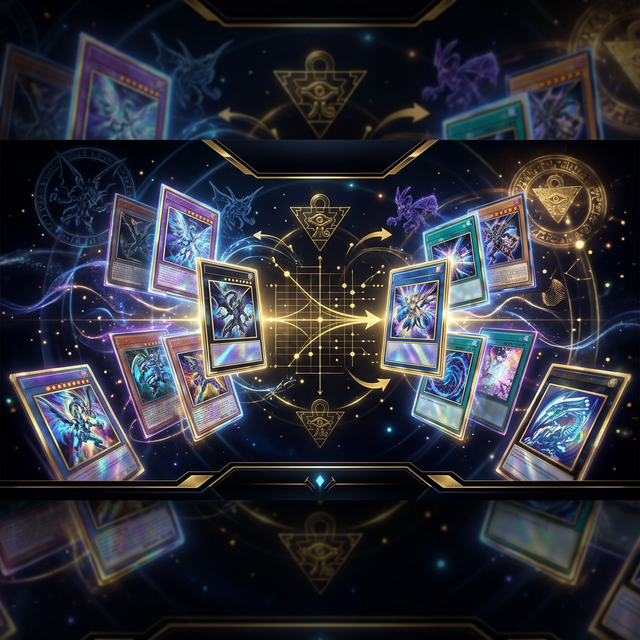

# 🎴 Yu-Gi-Oh! Deck Diff

**The ultimate utility for Duelists to optimize their deck building against Structure Decks.**

[Explore Features](#-key-features) • [Getting Started](#-getting-started) • [Tech Stack](#-built-with)

---

## ✨ Key Features

*   **⚡ Structure Deck Integration**
    Select from any official TCG Structure Deck. The tool automatically fetches card lists, including support for brand-new releases using live data.
*   **🧠 Smart Comparison**
    Paste your target decklist and optionally your existing collection. The app calculates exactly what you need to acquire, saving you time and money.
*   **💎 Premium UI/UX**
    Inspired by the *Master Duel* aesthetic, featuring a dark-themed, holographic interface with metallic gold accents and responsive design.
*   **🖼️ Rich Tooltips**
    Hover over any card to see high-quality artwork, card types, and full effect descriptions instantly.
*   **📊 Advanced Analytics**
    Real-time tracking of missing card counts, total estimated costs via TCGPlayer, and a color-coded breakdown of Monsters, Spells, and Traps.
*   **📋 Seamless Export**
    Quickly toggle between a visual card list and a raw text view. Copy your missing cards to your clipboard with a single click.

## 🚀 Getting Started

Getting up and running is as easy as opening a file.

1.  **Open the App**: Simply open [index.html](index.html) in any modern web browser.
2.  **Select a Deck**: Choose the Structure Deck you're building from and set the quantity (e.g., 3x).
3.  **Input Your Goal**: Paste your target decklist into the input area.
4.  **Analyze**: Hit **Compare Decks** and watch the magic happen!

## 🛠️ Built With

*   **Frontend**: Vanilla JavaScript (ES6+), Semantic HTML5.
*   **Styling**: Custom CSS3 design system with holographic effects.
*   **Typography**: Cinzel, Outfit, and JetBrains Mono via Google Fonts.
*   **API**: [YGOPRODeck API](https://ygoprodeck.com) for realtime card data and pricing.

## 🌐 Community & Deployment

This project is fully static and compatible with **GitHub Pages**.

> [!TIP]
> To host your own version: Push these files to a GitHub repository, go to **Settings > Pages**, and set the build branch to `main`.

---

Developed with passion for the Yu-Gi-Oh! community.

